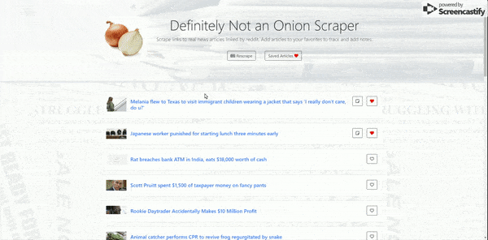

# DefinitelyNotAnOnionScraper
[Definitely Not An Onion Scraper](https://not-an-onion-scraper.herokuapp.com/)

Scrapes and saves news articles from reddit. You can mark them as favorites and even leave notes.

## Getting Started

Open up the [project link](https://not-an-onion-scraper.herokuapp.com/) and you should be able to see the webpage shown below:

Scrape the newest articles! Add interesting articles to the saved section and leave notes for yourself or others!

### Prerequisites

You need to have a modern browser able to handle html5, javascript, and css. 

### Installing

No installation needed! Just open the page in your preferred browser.

## Built With

* Html

* CSS

* [Javascript](https://www.javascript.com/) - The scripting language used

* [BootstrapCDN v4.1.0](https://getbootstrap.com/docs/4.1/getting-started/introduction/) - The web framework used

* [jQuery v3.3.1](http://jquery.com/) - Java library for DOM and CSS manipulation

* [Node.js](https://nodejs.org/en/) - JavaScript runtime

* [Node Package Manager](https://www.npmjs.com/) - Package manager for JavaScript and Node

* [Express](https://www.npmjs.com/package/express) - Server-side framework

* [Body Parser](https://www.npmjs.com/package/cli-table) - Request parsing middleware

* [Mongoose](http://mongoosejs.com/) - MongoDB ODM

* [Cheerio](https://www.npmjs.com/package/cheerio) - Server-side markup parser

## Authors

* **Robert Shaw** - *Initial work* - [robertshaw87](https://github.com/robertshaw87)
